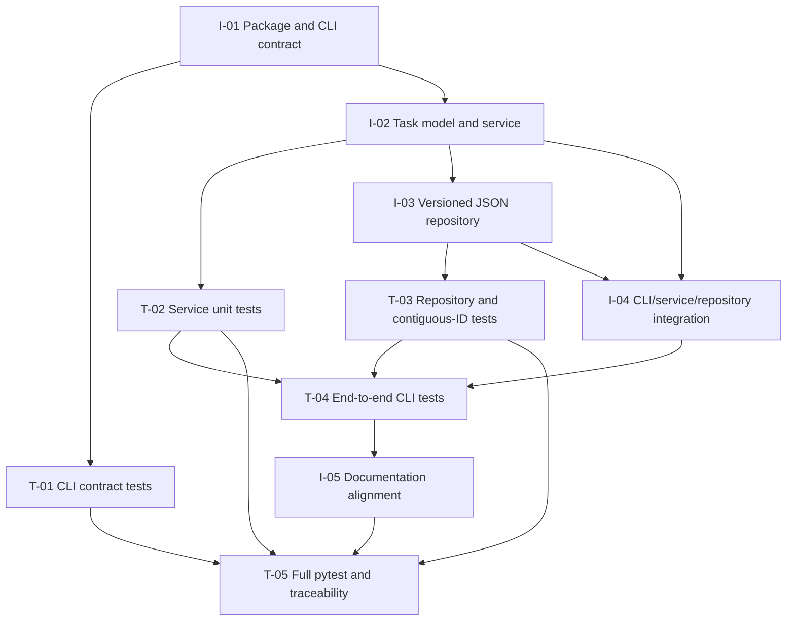

# Implementation Plan: Task List CLI

**Sources:** `docs/architecture.md`, `docs/design-review.md`, `docs/requirements.md`  
**Author:** Implementation Planner Agent  
**Date:** 2026-10-06

## Executive Summary

Implement the local Task List CLI in dependency order: establish an installable Python 3.11+ package and its CLI contract, implement task behavior, add validated version-1 JSON persistence, then connect and verify the complete command workflows. Each implementation task has a separate, focused paired test task. The two design-review findings are resolved as binding requirements: every invalid command or command input must report a clear error to stderr and exit 1, while top-level help exits 0; and with deletion out of scope, version-1 stored task IDs must be exactly `1` through `next_id - 1`, in creation order.

The application and its runtime imports must use only the Python standard library. Pytest is the development/test runner required for validation, not an application runtime dependency. The project already sets Python `>=3.11` and pytest discovery under `tests/`; implementation must preserve and use those settings. There are no external service or API dependencies.

Milestones:
1. Establish package/CLI behavior and prove parser-level exit and stream contracts.
2. Implement task rules and strictly validated, durable JSON storage.
3. Integrate command workflows, run focused subprocess tests, and pass the complete pytest suite.

## Ordered Task Table

Complexity: Low / Medium / High. Dependencies refer to task IDs in this table. Every implementation task is followed by its paired test task.

| ID | Title and short description | Files to create or modify | Definition of Done | Complexity | Dependencies | Blockers |
|---|---|---|---|---|---|---|
| I-01 | Package and CLI contract. Create the `task_list` package/module entry point and argument dispatch for `add`, `list`, and `complete`. Map every parser/dispatch error, including unknown commands and missing, malformed, or unexpected command arguments, to a clear stderr message and exit 1. Preserve top-level `-h`/`--help` with exit 0. Configure package metadata as needed for `python -m task_list`; do not add runtime dependencies. | `pyproject.toml`; `src/task_list/__init__.py`; `src/task_list/__main__.py`; `src/task_list/cli.py` | `python -m task_list --help` and `-h` describe all commands and exit 0; invalid command/input paths consistently write a non-empty actionable message to stderr, do not report errors on stdout, and exit 1; valid command forms dispatch without uncaught parser exceptions; package invocation works under the documented project setup; runtime imports remain standard-library-only. | Medium | None | None. Confirm the package/install invocation in implementation; no third-party runtime package is permitted. |
| T-01 | Paired CLI contract tests. Add focused tests for top-level help and invalid command/input behavior, including default-parser edge cases. | `tests/unit/test_cli.py` | Automated tests invoke the CLI and assert exit code, stderr, and stdout for help; unknown/no command; `add` without a description, with whitespace-only input, and with unexpected arguments; and `complete` with missing, malformed, non-positive, or extra ID arguments. All invalid cases exit exactly 1, and both help flags exit exactly 0. | Medium | I-01 | Pytest must be available in the development environment; it is not a runtime dependency. |
| I-02 | Task model and service. Implement task records and service operations for adding non-whitespace descriptions, creation-order listing, monotonic positive IDs, and pending-to-complete transitions. Reject unknown and already-complete IDs as domain errors. | `src/task_list/models.py`; `src/task_list/service.py` | Service operations implement FR-2 through FR-5 without filesystem or CLI formatting responsibilities; successful adds allocate the next ID and pending status; completion changes only a pending task; invalid descriptions and IDs produce distinguishable expected domain errors. | Medium | I-01 | None. |
| T-02 | Paired task-service unit tests. Verify task rules independently of CLI and disk behavior. | `tests/unit/test_service.py` | Tests prove the first ID is 1, successive IDs increase without reuse across the service state, descriptions are validated, listing preserves creation order, and completion succeeds once while unknown/already-complete IDs fail. | Low | I-02 | None. |
| I-03 | Versioned JSON repository and storage validation. Implement current-working-directory `.task-list.json` loading, version-1 schema/type/status/content validation, and same-directory temporary-file replacement for saves. Enforce the resolved contiguous-ID invariant: the stored IDs in creation order are exactly `1, 2, ..., next_id - 1`; therefore an empty task collection requires `next_id == 1`. Reject gaps, reordered IDs, invalid counters, unsupported versions, and malformed state rather than repairing or replacing it. | `src/task_list/storage.py` | Missing storage yields an empty version-1 state with `next_id == 1`; valid states load and save; invalid or unreadable state raises a storage error without being treated as empty; all stored task IDs satisfy the exact contiguous sequence and order invariant; failed writes leave the previous file intact where replacement has not succeeded. | High | I-02 | None. Atomic replacement is limited to the architecture's stated best-effort filesystem guarantee; concurrent writers remain out of scope. |
| T-03 | Paired repository tests, including the review finding. Exercise valid, missing, malformed, unsupported, unreadable, and unwritable storage cases and prove invalid state is not overwritten. | `tests/unit/test_storage.py`; `tests/fixtures/` (only if fixtures are useful) | Tests accept empty and contiguous valid states; reject gaps (for example IDs 1 and 3 with `next_id` 4), a sequence not starting at 1, reordered IDs, a counter inconsistent with the allocated sequence, malformed schema, and unsupported versions; prove a rejected load does not trigger an empty-state save or replace existing bytes; cover failed-save preservation where the platform/test setup permits. | Medium | I-03 | Filesystem permission behavior differs by OS; use deterministic repository-level fault injection for write failures when permission-based tests are unreliable. |
| I-04 | Wire CLI, service, and repository. Complete add/list/complete behavior, plain-text output, storage-error translation, current-directory persistence, and the required empty-list response. Add concise usage instructions for invoking the package if needed. | `src/task_list/cli.py`; `src/task_list/service.py`; `src/task_list/storage.py`; `README.md` | Successful add prints its positive ID; list prints creation-ordered ID/status/description rows or `No tasks found`; complete prints confirmation; domain and storage failures produce clear stderr errors and exit 1; data persists across invocations; read/parse/validation failures never cause replacement writes; no external services or non-stdlib runtime imports are introduced. | Medium | I-02, I-03 | None. |
| T-04 | Paired end-to-end CLI tests. Run commands as subprocesses in isolated temporary working directories to verify the real module invocation, streams, statuses, and persistence boundaries. | `tests/integration/test_cli.py` | Tests cover add then list/complete across invocations, empty/missing storage, output fields/order, unknown and already-complete task IDs, invalid command/input exit 1 with stderr, help exit 0, malformed/gapped stored state rejection without overwrite, and representative storage failures. Test execution does not depend on the caller's working directory. | High | I-04, T-02, T-03 | Pytest and a Python 3.11+ interpreter are environment prerequisites; both are available through the project's declared test/runtime setup or must be provisioned by the implementation environment. |
| I-05 | Documentation and final acceptance alignment. Ensure user-facing CLI usage and implementation-facing behavior agree with the requirements and the resolved design-review decisions; avoid changing the upstream requirements, architecture, or review artifacts. | `README.md`; implementation docstrings only where needed | Usage documents invocation and the three commands; documented errors and help status match implementation; the stdlib-only runtime constraint and version-1 contiguous-ID/no-deletion rule are not contradicted; no upstream design artifact is edited. | Low | I-04 | None. |
| T-05 | Paired final pytest validation and traceability check. Run the full suite and confirm requirement coverage before implementation handoff. | Existing `tests/unit/` and `tests/integration/`; `pyproject.toml` pytest configuration; `README.md` | `pytest` completes successfully using the configured `tests` discovery; all requirements FR-1 through FR-9 and acceptance criteria AC-1 through AC-13 have at least one linked test in T-01 through T-04; specifically, the invalid-input/help contract and contiguous-ID invariant each have focused tests; README invocation and command/error contracts match the implementation; verify application runtime imports use only the standard library. Record any environment limitation rather than weakening a test or adding runtime dependencies. | Medium | T-01, T-02, T-03, T-04, I-05 | Pytest must be installed to run this gate. If absent, install/provision it as a development test tool only; do not add it as an application runtime dependency. |

## Paired Test Tasks and Requirements Mapping

| Test task | Paired implementation task(s) | Requirements / acceptance criteria covered |
|---|---|---|
| T-01 | I-01 | FR-1, FR-8, FR-9; AC-1, AC-11, AC-13. Focused regression for review finding 1: all invalid commands and malformed/missing/unexpected input exit 1 with a clear stderr error; top-level help exits 0. |
| T-02 | I-02 | FR-2, FR-3, FR-4, FR-5; AC-2, AC-4, AC-5, AC-7, AC-8, AC-9. |
| T-03 | I-03 | FR-3, FR-6, FR-7; AC-4, AC-6, AC-10. Focused regression for review finding 2: reject any version-1 state whose creation-ordered IDs are not exactly `1..next_id - 1`. |
| T-04 | I-04 | FR-1 through FR-9; AC-1 through AC-13, including persistence across invocations, storage non-overwrite, invalid-input status/stream behavior, and standard-library runtime constraint. |
| T-05 | I-05 and the complete implementation | Full pytest validation and final requirements traceability; verifies both review findings remain covered by focused tests. |

## Dependency Graph

T-01 can proceed alongside I-02 once I-01 is complete. T-02 and I-03 follow I-02 and may proceed in parallel with each other. T-03 is required before integration acceptance; I-04 depends on both service and repository implementation. The final gate runs only after the focused tests and documentation alignment are complete.

## Blockers and Mitigations

- **External services/APIs:** None. The architecture intentionally has no network or service dependency.
- **Runtime third-party packages:** Prohibited by the requirements. Keep all application runtime imports in the standard library; check imports as part of T-05.
- **Pytest availability:** Required for the requested test validation but is a development environment prerequisite, not a runtime package. Provision pytest in the development environment if absent; do not introduce it into runtime dependencies.
- **Filesystem permission tests:** OS permissions may not reliably fail under every test account. Use fault injection around repository I/O for deterministic write/read error coverage, retaining a permission-based case only where portable.
- **Packaging invocation:** The architecture leaves installation details to implementation. Configure the existing project metadata so `python -m task_list` works with the intended `src/` layout, and document the invocation/setup without adding application runtime dependencies.

No task is blocked on a product decision: this plan resolves the review findings using the requirements and the explicit no-deletion scope. Concurrent writers, migration from unsupported storage versions, and non-stdlib runtime dependencies remain out of scope.
